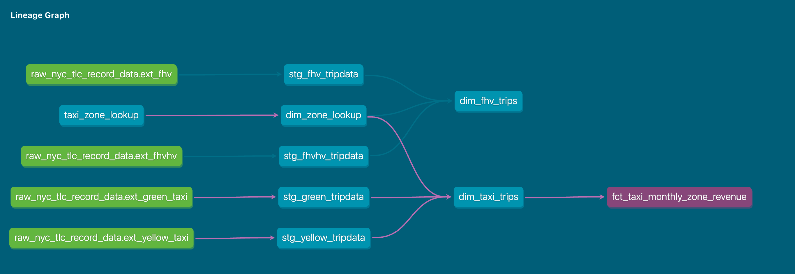

# Module 4 Homework

For this homework, the following datasets were used:

- Green Taxi dataset (2019 and 2020): 7,778,101 records
- Yellow Taxi dataset (2019 and 2020): 109,047,518 records
- For Hire Vehicle dataset (2019): 43,244,696 records

### Table of contents

- [Preparing dataset for FHV](#preparing-dataset-for-fhv)
- [Question 1](#question-1)
- [Question 2](#question-2)
- [Question 3](#question-3)
- [Question 4](#question-4)
- [Question 5](#question-5)
- [Question 6](#question-6)
- [Question 7](#question-7)


## Preparing dataset for FHV

- Upload dataset csv's into Google Cloud Storage Bucket

- Created external table for Yellow Datasets (ext_yellow_taxi) and Green Datasets (ext_green_taxi) inside BigQuery

- Create final table for FHV in BigQuery

## Question 1

**Understanding dbt model resolution**

Provided you've got the following sources.yaml:

```yaml

version: 2

sources:
  - name: raw_nyc_tripdata
    database: "{{ env_var('DBT_BIGQUERY_PROJECT', 'dtc_zoomcamp_2025') }}"
    schema:   "{{ env_var('DBT_BIGQUERY_SOURCE_DATASET', 'raw_nyc_tripdata') }}"
    tables:
      - name: ext_green_taxi
      - name: ext_yellow_taxi

```

with the following env variables setup where dbt runs:

```bash
export DBT_BIGQUERY_PROJECT=myproject
export DBT_BIGQUERY_DATASET=my_nyc_tripdata
```

What does this .sql model compile to?

```sql

select * 
from {{ source('raw_nyc_tripdata', 'ext_green_taxi' ) }}
```

**Resolution:**

- env_var('DBT_BIGQUERY_PROJECT', 'dtc_zoomcamp_2025') resolves to myproject.
- env_var('DBT_BIGQUERY_SOURCE_DATASET', 'raw_nyc_tripdata') resolves to raw_nyc_tripdata.

source('raw_nyc_tripdata', 'ext_green_taxi') will resolve to:

```myproject.raw_nyc_tripdata.ext_green_taxi```

The .sql model compiles to:

```select * from `myproject.raw_nyc_tripdata.ext_green_taxi` ```


## Question 2

**dbt Variables & Dynamic Models**

Say you have to modify the following dbt_model (fct_recent_taxi_trips.sql) to enable Analytics Engineers
to dynamically control the date range.

- In development, you want to process only the last 7 days of trips
- In production, you need to process the last 30 days for analytics

```sql

select *
from {{ ref('fact_taxi_trips') }}
where pickup_datetime >= CURRENT_DATE - INTERVAL '30' DAY

```

What would you change to accomplish that in a such way that command line arguments takes precedence 
over ENV_VARs, which takes precedence over DEFAULT value?

```sql

select *
from {{ ref('fact_taxi_trips') }}
where pickup_datetime >= CURRENT_DATE - INTERVAL '{{ var("days_back", env_var("DAYS_BACK", 30)) }}' DAY

```

- `var("days_back", ...)`: Looks for a command-line argument first.

- `env_var("DAYS_BACK", "30")`: If no command-line argument is found, it falls back to the DAYS_BACK environment variable.

- `"30"`: If neither is found, it defaults to 30 days.


## Question 3

**dbt Data Lineage and Execution**

Considering the data lineage below **and** that taxi_zone_lookup is the **only** materialization build (from a .csv seed file):



Select the option that does NOT apply for materializing `fct_taxi_monthly_zone_revenue`:

*Explanation:*

✅ `dbt run`
Runs all models, so it applies for materializing fct_taxi_monthly_zone_revenue.

✅ `dbt run --select +models/core/dim_taxi_trips.sql+ --target prod`
The + before and after means it runs dim_taxi_trips and all its dependencies and dependents, which includes `fct_taxi_monthly_zone_revenue`.

✅ `dbt run --select +models/core/fct_taxi_monthly_zone_revenue.sql`
The + ensures dependencies `like dim_taxi_trips` are run, so this applies.

✅ `dbt run --select +models/core/`
Runs all models in core/, which includes `dim_taxi_trips` and `fct_taxi_monthly_zone_revenue`, so it applies.

❌ `dbt run --select models/staging/+`
This only runs staging models (`stg_green_tripdata`, `stg_yellow_tripdata`, etc.), not `fct_taxi_monthly_zone_revenue`.
Since `fct_taxi_monthly_zone_revenue` is in `core/`, this option does NOT apply.


## Question 4

**dbt Macros and Jinja**

Consider you're dealing with sensitive data, that is only available to your team and very selected few individuals, in the raw layer of your DWH.

Among other things, you decide to obfuscate/masquerade that data through your staging models, and make it available in a different schema (a staging layer) for other Data/Analytics Engineers to explore.

And optionally, yet another layer (service layer), where you'll build your dimension (dim_) and fact (fct_) tables (assuming the Star Schema dimensional modeling) for Dashboarding and for Tech Product Owners/Managers

You decide to make a macro to wrap a logic around it:

```



    
    

     {{- env_var(target_env_var) -}}
                        {{- env_var(stging_env_var, env_var(target_env_var)) -}}
    



```

And use on your staging, dim_ and fact_ models as:

```

{{ config(
    schema=resolve_schema_for('core'), 
) }}

```

That all being said, regarding macro above, select all statements that are true to the models using it:

- ✅ Setting a value for DBT_BIGQUERY_TARGET_DATASET env var is mandatory, or it'll fail to compile: If model_type is 'core', it directly uses the environment variable DBT_BIGQUERY_TARGET_DATASET. DBT_BIGQUERY_TARGET_DATASET must be defined, or it will fail. **TRUE**

- ❌ Setting a value for DBT_BIGQUERY_STAGING_DATASET env var is mandatory, or it'll fail to compile: If model_type is NOT 'core', it first tries to use DBT_BIGQUERY_STAGING_DATASET, but if it's not defined, it falls back to DBT_BIGQUERY_TARGET_DATASET. DBT_BIGQUERY_STAGING_DATASET is optional. **FALSE**

- ✅ When using core, it materializes in the dataset defined in DBT_BIGQUERY_TARGET_DATASET: When model_type == 'core', only DBT_BIGQUERY_TARGET_DATASET is used. **TRUE**

- ✅ When using stg, it materializes in the dataset defined in DBT_BIGQUERY_STAGING_DATASET, or defaults to DBT_BIGQUERY_TARGET_DATASET: If DBT_BIGQUERY_STAGING_DATASET is defined, it will be used; otherwise, DBT_BIGQUERY_TARGET_DATASET is used as the fallback. **TRUE**

- ✅ When using staging, it materializes in the dataset defined in DBT_BIGQUERY_STAGING_DATASET, or defaults to DBT_BIGQUERY_TARGET_DATASET:  Same logic as in the previous case. **TRUE**


## Question 5

**Taxi Quarterly Revenue Growth**

1. Create a new model `fct_taxi_trips_quarterly_revenue.sql`
2. Compute the Quarterly Revenues for each year for based on `total_amount`
3. Compute the Quarterly YoY (Year-over-Year) revenue growth 
  * e.g.: In 2020/Q1, Green Taxi had -12.34% revenue growth compared to 2019/Q1
  * e.g.: In 2020/Q4, Yellow Taxi had +34.56% revenue growth compared to 2019/Q4

***Important Note: The Year-over-Year (YoY) growth percentages provided in the examples are purely illustrative. You will not be able to reproduce these exact values using the datasets provided for this homework.***

Considering the YoY Growth in 2020, which were the yearly quarters with the best (or less worse) and worst results for green, and yellow

- green: {best: 2020/Q2, worst: 2020/Q1}, yellow: {best: 2020/Q2, worst: 2020/Q1}
- green: {best: 2020/Q2, worst: 2020/Q1}, yellow: {best: 2020/Q3, worst: 2020/Q4}
- green: {best: 2020/Q1, worst: 2020/Q2}, yellow: {best: 2020/Q2, worst: 2020/Q1} 
- ✅ green: {best: 2020/Q1, worst: 2020/Q2}, yellow: {best: 2020/Q1, worst: 2020/Q2}
- green: {best: 2020/Q1, worst: 2020/Q2}, yellow: {best: 2020/Q3, worst: 2020/Q4}


SOLUTION: 


"fct_taxi_trips_quarterly_revenue.sql"


```sql

WITH quarterly_revenue AS (
    SELECT
        year,
        quarter,
        year_quarter,
        service_type,
        SUM(revenue_monthly_total_amount) AS total_revenue
    FROM {{ ref('dm_monthly_zone_revenue') }}
    GROUP BY 1, 2, 3, 4
),
yoy_revenue AS (
    SELECT
        qr.year,
        qr.quarter,
        qr.year_quarter,
        qr.service_type,
        qr.total_revenue,
        LAG(qr.total_revenue) OVER (
            PARTITION BY qr.service_type, qr.quarter
            ORDER BY qr.year
        ) AS prev_year_revenue,
        ROUND(
            (qr.total_revenue - LAG(qr.total_revenue) OVER (
                PARTITION BY qr.service_type, qr.quarter
                ORDER BY qr.year
            )) / NULLIF(LAG(qr.total_revenue) OVER (
                PARTITION BY qr.service_type, qr.quarter
                ORDER BY qr.year
            ), 0) * 100, 2
        ) AS yoy_growth
    FROM quarterly_revenue qr
)
SELECT 
    year,
    quarter,
    year_quarter,
    service_type,
    total_revenue,
    prev_year_revenue,
    yoy_growth
FROM yoy_revenue

```


Query on BIGQUERY:

```sql

SELECT yoy_growth, year, quarter, service_type, total_revenue, prev_year_revenue
FROM `my-de-zoomcamp-469910.zoomcamp_dbt_04.fct_taxi_trips_quaterly_revenue` 
WHERE year=2020
ORDER BY yoy_growth DESC
LIMIT 10

```


## Question 6

**P97/P95/P90 Taxi Monthly Fare**

1. Create a new model `fct_taxi_trips_monthly_fare_p95.sql`
2. Filter out invalid entries (`fare_amount > 0`, `trip_distance > 0`, and `payment_type_description in ('Cash', 'Credit card')`)
3. Compute the **continous percentile** of `fare_amount` partitioning by service_type, year and and month

Now, what are the values of `p97`, `p95`, `p90` for Green Taxi and Yellow Taxi, in April 2020?

- green: {p97: 55.0, p95: 45.0, p90: 26.5}, yellow: {p97: 52.0, p95: 37.0, p90: 25.5}
- ✅ green: {p97: 55.0, p95: 45.0, p90: 26.5}, yellow: {p97: 31.5, p95: 25.5, p90: 19.0}
- green: {p97: 40.0, p95: 33.0, p90: 24.5}, yellow: {p97: 52.0, p95: 37.0, p90: 25.5}
- green: {p97: 40.0, p95: 33.0, p90: 24.5}, yellow: {p97: 31.5, p95: 25.5, p90: 19.0}
- green: {p97: 55.0, p95: 45.0, p90: 26.5}, yellow: {p97: 52.0, p95: 25.5, p90: 19.0}


SOLUTION:

```sql

fct_taxi_trips_monthly_fare_p95.sql:

{{
    config(
        materialized='table'
    )
}}  

WITH filtered_trips AS (
    SELECT 
        service_type,
        EXTRACT(YEAR FROM pickup_datetime) AS year,
        EXTRACT(MONTH FROM pickup_datetime) AS month,
        fare_amount
    FROM {{ ref('fct_all_trips') }}
    WHERE 
        fare_amount > 0 
        AND trip_distance > 0 
        AND payment_type_description IN ('Cash', 'Credit card')
),

percentile_fares AS (
    SELECT 
        service_type,
        year,
        month,
        PERCENTILE_CONT(fare_amount, 0.97) OVER (PARTITION BY service_type, year, month) AS fare_p97,
        PERCENTILE_CONT(fare_amount, 0.95) OVER (PARTITION BY service_type, year, month) AS fare_p95,
        PERCENTILE_CONT(fare_amount, 0.90) OVER (PARTITION BY service_type, year, month) AS fare_p90
    FROM filtered_trips
)

SELECT DISTINCT service_type, year, month, fare_p97, fare_p95, fare_p90
FROM percentile_fares

```


Query on BigQuery:

```sql

SELECT DISTINCT service_type, year, month, fare_p97, fare_p95, fare_p90 
FROM `my-de-zoomcamp-469910.zoomcamp_dbt_04.fct_taxi_trips_monthly_fare_p95`
WHERE month = 4 AND year = 2020;

```

**Check results:**

<br>


<br>


## Question 7

**Top #Nth longest P90 travel time Location for FHV**

Prerequisites:
* Create a staging model for FHV Data (2019), and **DO NOT** add a deduplication step, just filter out the entries where `where dispatching_base_num is not null`
* Create a core model for FHV Data (`dim_fhv_trips.sql`) joining with `dim_zones`. Similar to what has been done [here](../../../04-analytics-engineering/taxi_rides_ny/models/core/fact_trips.sql)
* Add some new dimensions `year` (e.g.: 2019) and `month` (e.g.: 1, 2, ..., 12), based on `pickup_datetime`, to the core model to facilitate filtering for your queries

Now...
1. Create a new model `fct_fhv_monthly_zone_traveltime_p90.sql`
2. For each record in `dim_fhv_trips.sql`, compute the [timestamp_diff](https://cloud.google.com/bigquery/docs/reference/standard-sql/timestamp_functions#timestamp_diff) in seconds between dropoff_datetime and pickup_datetime - we'll call it `trip_duration` for this exercise
3. Compute the **continous** `p90` of `trip_duration` partitioning by year, month, pickup_location_id, and dropoff_location_id

For the Trips that **respectively** started from `Newark Airport`, `SoHo`, and `Yorkville East`, in November 2019, what are **dropoff_zones** with the 2nd longest p90 trip_duration ?

- ✅ LaGuardia Airport, Chinatown, Garment District
- LaGuardia Airport, Park Slope, Clinton East
- LaGuardia Airport, Saint Albans, Howard Beach
- LaGuardia Airport, Rosedale, Bath Beach
- LaGuardia Airport, Yorkville East, Greenpoint


SOLUTION:

*Explanation*
🔹 **Extract Year & Month** → Since we need to group by year and month, we use `EXTRACT(YEAR FROM pickup_datetime)` and `EXTRACT(MONTH FROM pickup_datetime)`.

🔹 **Compute trip_duration** → We use `TIMESTAMP_DIFF(dropoff_datetime, pickup_datetime, SECOND)` to get the duration in seconds.

🔹 **Partition by the required fields** → `PERCENTILE_CONT(trip_duration, 0.90) OVER (PARTITION BY year, month, pickup_location_id, dropoff_location_id)` ensures that we compute the continuous 90th percentile for each group.

🔹 **Remove duplicates with DISTINCT** → Since `PERCENTILE_CONT` is a window function, we select only distinct results.


Query on BigQuery:

```sql

WITH ranked_trips AS (
    SELECT 
        pz.zone AS pickup_zone,
        dz.zone AS dropoff_zone,
        t.travel_time_p90,
        ROW_NUMBER() OVER (
            PARTITION BY pz.zone
            ORDER BY t.travel_time_p90 DESC
        ) AS trip_rank
    FROM my-de-zoomcamp-469910.zoomcamp_dbt_04.fct_fhv_monthly_zone_traveltime_p90 t
    JOIN my-de-zoomcamp-469910.zoomcamp_dbt_04.dim_zones pz ON t.pickup_locationid = pz.locationid
    JOIN my-de-zoomcamp-469910.zoomcamp_dbt_04.dim_zones dz ON t.dropoff_locationid = dz.locationid
    WHERE 
        t.year = 2019 
        AND t.month = 11
        AND pz.zone IN ('Newark Airport', 'SoHo', 'Yorkville East')
)

SELECT 
    pickup_zone, 
    dropoff_zone, 
    travel_time_p90
FROM ranked_trips
WHERE trip_rank = 2;
--WHERE trip_rank <= 5 --to get the 5th values for comparision with the answers.

```

**Check results:**

<br>


<br>